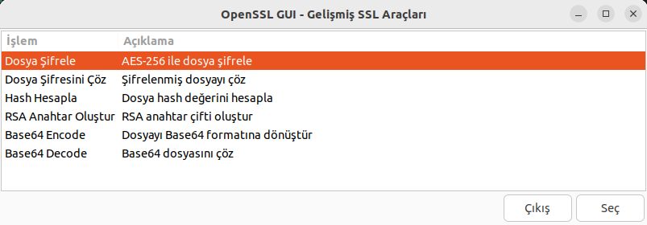
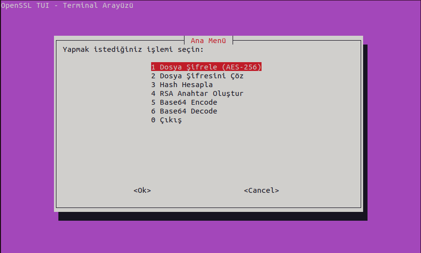
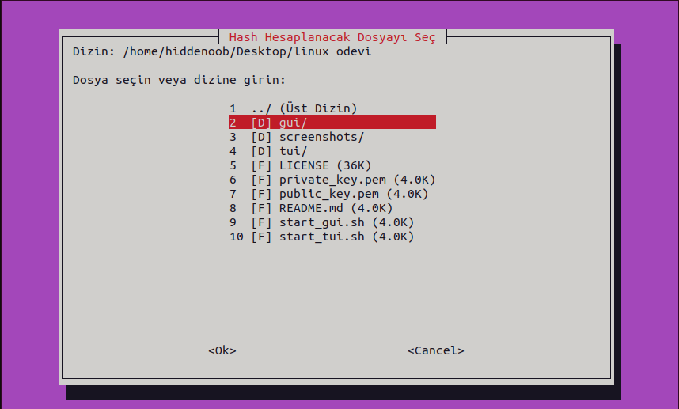

# OpenSSL GUI & TUI Şifreleme Araçları

Bu proje, karmaşık OpenSSL komutlarını kullanıcı dostu arayüzlerle (GUI ve TUI) basitleştiren, Shell Scripting tabanlı bir güvenlik aracıdır. **PARDUS** işletim sistemi ile tam uyumludur.

## Proje Tanıtımı

Linux terminalindeki güçlü şifreleme araçlarını kullanmak hiç bu kadar kolay olmamıştı. Bu proje sayesinde komut satırı parametrelerini ezberlemeden dosya şifreleyebilir, anahtar üretebilir ve hash hesaplayabilirsiniz.

Proje iki farklı arayüz sunar:
1. **GUI (Grafik Arayüz):** `yad` kullanarak modern pencereler sunar.
2. **TUI (Terminal Arayüzü):** `whiptail` kullanarak terminal içinde grafiksel menüler sunar.

## Tanıtım Videosu

Projenin kurulumu, özellikleri ve kullanımını anlatan detaylı videoya aşağıdan ulaşabilirsiniz:

[](https://www.youtube.com/watch?v=Ag_GA7nxlGA)


## Ekran Görüntüleri

### GUI Arayüzü

*Modern ve kullanıcı dostu arayüz*

### TUI Arayüzü

*Terminal tabanlı hızlı menü sistemi*


*TUI içinde entegre dosya gezgini*


## Kurulum ve Sistem Gereksinimleri

Bu proje **PARDUS**, Ubuntu, Debian ve diğer Debian tabanlı dağıtımlarda sorunsuz çalışır.

### Gerekli Paketler
Aşağıdaki komutu terminalde çalıştırarak tüm bağımlılıkları kurabilirsiniz:

```bash
sudo apt update
sudo apt install openssl whiptail yad
```

- **openssl:** Şifreleme işlemleri için çekirdek paket.
- **whiptail:** TUI (Terminal) arayüzü için gerekli.
- **yad:** GUI (Grafik) arayüzü için gerekli.

## Kullanım

Projeyi indirdikten sonra terminali proje klasöründe açın ve aşağıdaki adımları izleyin.

### Çalıştırma İzinlerini Verme
İlk kullanım öncesi scriptlere çalıştırma izni vermelisiniz:
```bash
chmod +x start_gui.sh start_tui.sh gui/main.sh gui/modules/*.sh tui/main.sh tui/modules/*.sh tui/utils/*.sh
```

### Grafik Arayüzü (GUI) Başlatma
```bash
./start_gui.sh
```

### Terminal Arayüzü (TUI) Başlatma
```bash
./start_tui.sh
```

## Özellikler

| Özellik | Açıklama |
|---------|----------|
| **AES-256 Şifreleme** | Endüstri standardı güçlü şifreleme. |
| **RSA Anahtar** | 2048, 4096 ve 8192 bit anahtar çifti üretimi. |
| **Hash Hesaplama** | MD5, SHA1, SHA256, SHA512 desteği. |
| **Base64 Dönüştürme** | Dosyaları metin formatına çevirme (Encode/Decode). |

## Proje Yapısı

```
linux odevi/
├── start_gui.sh              # GUI başlatıcı script
├── start_tui.sh              # TUI başlatıcı script
├── screenshots/              # Ekran görüntüleri klasörü
├── gui/                      # GUI kaynak kodları
│   ├── main.sh
│   ├── modules/ (encryption, hash, rsa, base64)
│   └── utils/
└── tui/                      # TUI kaynak kodları
    ├── main.sh
    ├── modules/ (encryption, hash, rsa, base64)
    └── utils/ (file_browser)
```
